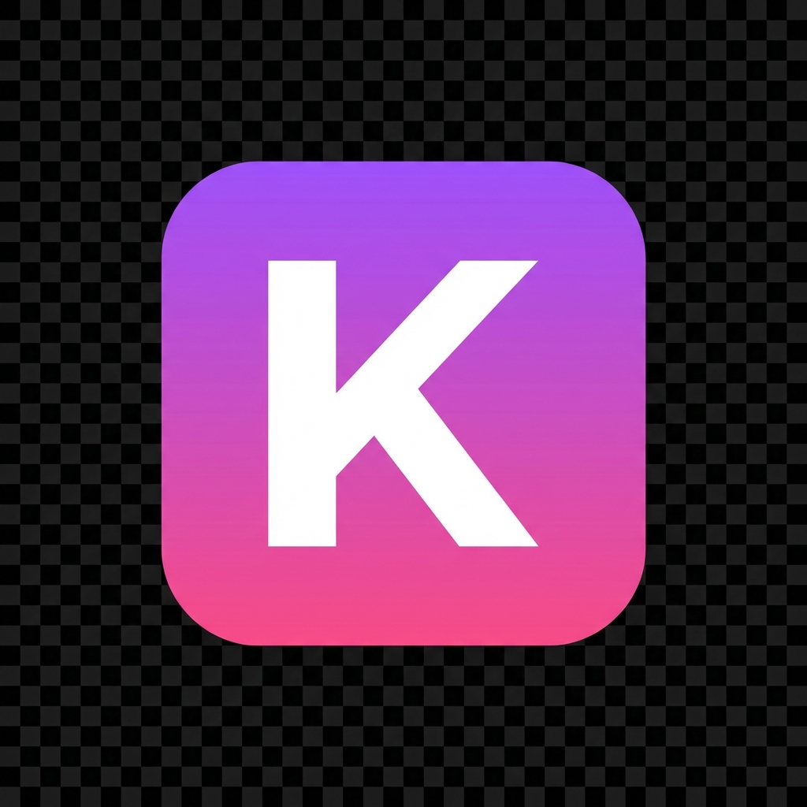

# Kroma

<div align="center">
  
  <h1>Kroma</h1>
  <p>A beautiful, modern, and high-performance Twitch chat overlay.</p>
</div>

## Features
- **Premium Aesthetics**: Glassmorphism, smooth animations, and a modern dark theme.
- **Shared Chat Support**: Seamlessly displays messages from shared streams with source channel indicators.
- **Rich Emote Support**: 7TV, BTTV, and FFZ support.
- **Customizable**: Adjust privacy settings, badges, prints, and more via the setup page.
- **OBS Ready**: Simply drag and drop the configuration into OBS.

## Usage
1. Go to the [Setup Page](http://localhost:3000/v3/).
2. Enter your Twitch channel.
3. Drag the "Drag to OBS" button into your OBS sources.

## Development
Created by **scaptiq**. Based on [ChatIS](https://github.com/IS2511/ChatIS).

### Run Locally
```bash
npm install
npm run dev
```
